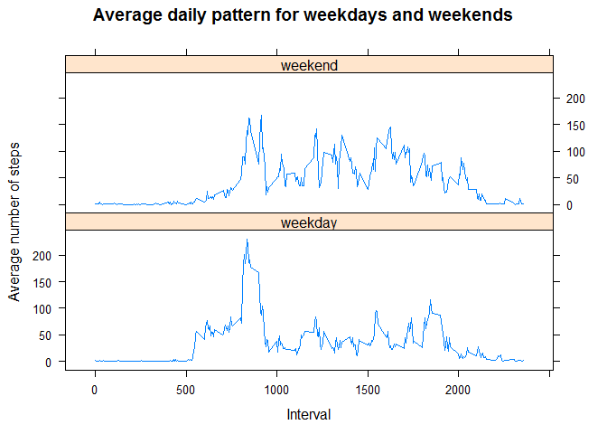

# Reproducible Research: Peer Assessment 1
Olga Hartoog  
20-10-2017  


## Loading and preprocessing the data


```r
activity <- read.csv("activity.csv")

activity$date <- as.Date(activity$date)
```

## What is mean total number of steps taken per day?
Load the libraries for the assignment

```r
library(dplyr)
library(lattice)
```

Calculate and show the total number of steps per day

```r
activity_daily <- activity %>% group_by(date) %>% summarise(totalsteps = sum(steps))
hist(activity_daily$totalsteps,
     breaks = 30,
     main = "Histogram of total number of steps per day",
     xlab = "Total number of steps per day"
     )
```

<!-- -->

Calulate the median and mean of the total number of steps per day.

```r
median(activity_daily$totalsteps,na.rm = TRUE)
```

```
## [1] 10765
```

```r
mean(activity_daily$totalsteps,na.rm = TRUE)
```

```
## [1] 10766.19
```

## What is the average daily activity pattern?

```r
activity_avgday <- activity %>% group_by(interval) %>% summarise(meansteps = mean(steps,na.rm = TRUE))
plot(activity_avgday$interval,
     activity_avgday$meansteps,
     type = "l",
     xlab = "Interval",
     ylab = "Average number of steps",
     main = "Time series of average activity over the day"
     )
```

<!-- -->

The interval with the highest average number of steps:

```r
activity_avgday[which.max(activity_avgday$meansteps),]
```

```
## # A tibble: 1 x 2
##   interval meansteps
##      <int>     <dbl>
## 1      835  206.1698
```


The interval with the maximum average number of steps is 835.

## Imputing missing values
Total number of missing values in the data:

```r
sum(is.na(activity$steps))
```

```
## [1] 2304
```

Imputing the missing values with the mean number of steps of the interval:

```r
activity_imputed <- merge(activity,activity_avgday)

activity_imputed$steps <- ifelse(is.na(activity_imputed$steps),
                                  activity_imputed$meansteps,
                                  activity_imputed$steps)

activity_imputed$meansteps <- NULL
```

Show the histogram for the imputed dataset:

```r
activity_imputed_daily <- activity_imputed %>% group_by(date) %>% summarise(totalsteps = sum(steps))

hist(activity_imputed_daily$totalsteps,
     breaks = 30,
     main = "Histogram of total number of steps per day",
     xlab = "Total number of steps per day"
     )
```

<!-- -->

Calulate the median and mean of the total number of steps per day on the imputed file.

```r
median(activity_imputed_daily$totalsteps,na.rm = TRUE)
```

```
## [1] 10766.19
```

```r
mean(activity_imputed_daily$totalsteps,na.rm = TRUE)
```

```
## [1] 10766.19
```
This mean and median do not differ significantly from those based on the original dataset. This means that the the shape of the distubution had not alterted by imputing the missing values, which is good. 

## Are there differences in activity patterns between weekdays and weekends?

Create a new factor variable indicating if the date is a weekday or a weekend day

```r
activity_imputed$weekend <- 
            as.factor(
              ifelse(weekdays(activity_imputed$date) %in% c("zaterdag","zondag"),
                     "weekend",
                     "weekday"
                     )
              )
```

Show the difference in the daily pattern for weekdays and weekend days:

```r
activity_imputed_avgday <- activity_imputed %>% group_by(interval,weekend) %>% summarise(meansteps = mean(steps,na.rm = TRUE))

xyplot(activity_imputed_avgday$meansteps~activity_imputed_avgday$interval|activity_imputed_avgday$weekend,
       type = 'l',
       main = "Average daily pattern for weekdays and weekends",
       xlab = "Interval",
       ylab = "Average number of steps", 
       layout = c(1,2)
       )
```

<!-- -->
